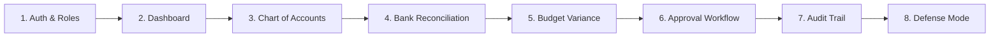

# 🎓 Computerised Financial Audit Support System (CFASS)
> **Faculty of Computing · University of Calabar (UNICAL)**  
> *A modern, audit-ready financial management and automated compliance system for public university administration.*

---

## 📌 Read This First! (Student & Presenter Guide)

Welcome to **CFASS**! This `README.md` is designed as your **pre-flight student guide**. Before launching the software or standing in front of a panel of examiners, deans, or auditors, read through this guide to understand:
1. What the software does in **plain English** (no technical jargon).
2. How to explain each feature confidently so you **never fumble**.
3. How to run a smooth **5-minute live demonstration**.

---

## 🚀 Quick Start: How to Run the Application

If you haven't already started the local server, follow these commands in your terminal:

```bash
# 1. Install project dependencies (if not already done)
npm install

# 2. Start the Vite local development server
npm run dev
```

Once started, open your browser and navigate to:
👉 **`http://localhost:5173`** (or the URL shown in your terminal).

---

## 🏛️ What is CFASS? (The 30-Second Elevator Pitch)

> *"CFASS is a specialized software system built for university faculties to replace paper ledgers and error-prone spreadsheets. It automates financial record-keeping, automatically catches bank statement mismatches, prevents unauthorized spending using a 3-step approval chain, and maintains an unalterable digital log of every action taken. It guarantees 100% financial transparency and enforces international public sector accounting rules."*

---

## 📦 Feature-by-Feature Explanations (Student Cheat Sheet)



---

### 1. 🔑 Secure Authentication & Role-Based Access
* **What it is:** The digital security guard at the door.
* **How to explain it:** Different users have different permissions based on their job role:
  * **Data Entry Officer (Chukwuma / Ngozi):** Can record transactions and submit payments, but *cannot* approve them.
  * **Auditor (Dr. Effiong Bassey):** Can review, flag missing documents, or approve routine transactions.
  * **Faculty Administrator (Prof. Asuquo Edet / Dean):** Has final sign-off authority for major capital expenses.
* **Why it matters:** Prevents unauthorized staff from approving their own payments or touching faculty funds.

---

### 2. 📊 Executive Financial Dashboard
* **What it is:** The executive control tower.
* **How to explain it:** Gives the Dean or Auditor an instant 5-second health check of the faculty’s money without reading thick paper reports:
  * **Total Revenue (Income):** e.g., ₦21,575,000 (FGN Subventions, TETFund research grants, tuition, software consultancy).
  * **Total Expenditure (Spending):** e.g., ₦16,365,000 (Staff salaries, lab workstations, electricity bills, journal subscriptions).
  * **Net Financial Balance:** e.g., ₦5,210,000 (Current remaining balance).
  * **Risk Badges:** Red notification indicators pointing directly to unresolved bank errors and pending approvals.

---

### 3. 📖 Chart of Accounts & General Ledger
* **What it is:** The digital master record book.
* **How to explain it:** Every single Naira coming in or going out is categorized under standardized account codes (e.g., `EXP-103` for Lab Equipment, `REV-001` for FGN Grants).
* **Key Demonstration:** Click **"+ New Transaction"** to show how staff input new entries, select categories, and validate debit/credit figures.
* **Why it matters:** Enforces double-entry bookkeeping so no money gets misclassified or unaccounted for.

---

### 4. 🔄 Automated Bank Reconciliation (Detective Tool)
* **What it is:** Compares internal faculty books against actual bank statements automatically.
* **How to explain it:** Show the side-by-side matching view:
  * 🟢 **Green "Matched":** Internal ledger matches bank statement perfectly.
  * 🔴 **Red "Discrepancy" (BST-004):** Computer procurement entry says internal ledger paid **₦3,200,000**, but the Bank Statement debited **₦3,150,000** — a **₦50,000 discrepancy**!
  * 🟠 **Orange "Unmatched" (BST-008):** A bank processing fee of **₦45,000** appears on the bank statement with NO internal receipt or voucher.
* **Why it matters:** Catches bank errors, hidden bank charges, and missing invoices before money vanishes.

---

### 5. 📈 Budget Variance Analysis (Budget Watchdog)
* **What it is:** Compares what was *budgeted* for the year against what was *actually spent*.
* **How to explain it:** Visual progress bars track spending for each department line item.
* **Key Feature:** If spending exceeds the budget allocation by more than **15%**, CFASS automatically flags an **Anomaly Warning** in red.
* **Why it matters:** Prevents departments from overspending beyond approved limits mid-year.

---

### 6. 🌿 Multi-Stage Approval Workflow (Segregation of Duties)
* **What it is:** The 3-tier authorization chain for payments.
* **How to explain it:** Implements the **Four-Eyes Principle**. A payment request moves through 3 stages:  
  `Stage 1: Data Entry Officer` ➔ `Stage 2: Auditor` ➔ `Stage 3: Faculty Administrator / Dean`
* **Interactive Controls:**
  * 🟢 **Approve:** Advances request to the next stage or gives final clearance.
  * 🟡 **Flag for Review:** Pauses approval and logs a note (e.g., "Vendor invoice number missing").
  * 🔴 **Reject:** Permanently cancels the payment request with a mandatory reason.

---

### 7. 🛡️ Immutable Electronic Audit Trail (System "Black Box")
* **What it is:** An un-erasable digital log of every single action in the system.
* **How to explain it:** Point to the table displaying:
  * **Timestamp:** Exact date and time to the second.
  * **User & Role:** Who performed the action.
  * **Action Taken:** e.g., Created Record, Approved Record, Flagged Record.
  * **IP Address:** Computer identification number (e.g., `10.20.5.210`).
* **Why it matters:** The audit log is **read-only and append-only**. Nobody—not even an administrator—can edit or delete history. This guarantees **100% accountability (non-repudiation)**.

---

### 8. 🎓 Academic Defense Mode Toggle (The Presentation Hero)
* **What it is:** A built-in presentation switch located in the top navigation bar.
* **How to explain it:** Toggle it ON to display an amber banner and contextual cards that map every software module directly to its governing international standard:
  * **Dashboard** ➔ IPSAS 24 (Budget Presentation)
  * **Chart of Accounts** ➔ IPSAS 1 (Financial Statements) & ISA 500 (Audit Evidence)
  * **Reconciliation** ➔ ISA 505 (External Confirmations) & ISA 330 (Risk Responses)
  * **Variance Analysis** ➔ ISA 520 (Analytical Procedures)
  * **Approval Workflow** ➔ COSO Internal Control Framework & ISA 315
  * **Audit Trail** ➔ ISA 230 (Audit Documentation) & ISAE 3402
* **Why it matters:** Proves to examiners that the software strictly adheres to global accounting and auditing standards.

---

## 🎬 5-Minute Live Presentation Script (Never Fumble!)

When presenting to a panel or defense board, follow this simple 5-step script:

1. **Minute 1 — Introduction & Dashboard:**  
   *"Good day Panel. CFASS brings financial automation and transparency to UNICAL's Faculty of Computing. On this dashboard, you see real-time figures for Revenue, Expenditure, and Net Balance, along with red flags for bank discrepancies."*
2. **Minute 2 — Chart of Accounts:**  
   *"Click 'Chart of Accounts'. Here, every transaction is categorized under standardized codes like EXP-103 for computers or REV-002 for TETFund grants. Double-entry rules are enforced automatically."*
3. **Minute 3 — Bank Reconciliation:**  
   *"Click 'Reconciliation'. CFASS automatically matches internal books against bank statements. Notice this red badge—it immediately caught a ₦50,000 mismatch between our computer voucher and the bank statement."*
4. **Minute 4 — Approval Workflow & Audit Trail:**  
   *"Click 'Approval Workflow'. Money cannot be spent by one person alone. It passes 3 stages: Entry ➔ Auditor ➔ Dean. Now click 'Audit Trail'—every click we just made is permanently logged with timestamps and IP addresses."*
5. **Minute 5 — Academic Defense Mode (Mic Drop):**  
   *"Finally, look at the top bar as I turn ON Academic Defense Mode. CFASS maps every module to international IPSAS and ISA standards, proving our software aligns with global auditing frameworks."*

---

## ❓ Frequently Asked Defense Questions & Answers

| Question | Winning Answer |
| :--- | :--- |
| **"What happens if a user tries to delete an audit log?"** | *"They cannot. The audit trail is architected as an immutable, read-only log. It cannot be altered or erased by any user role."* |
| **"How does the system prevent unauthorized payments?"** | *"Through Segregation of Duties. Data Entry officers cannot approve payments; approvals require 3 distinct authorization stages up to the Dean."* |
| **"How does reconciliation detect fraud?"** | *"It compares internal ledger records against external bank statements, instantly flagging mismatched figures or unauthorized bank deductions."* |
| **"What accounting standards does this system support?"** | *"IPSAS (International Public Sector Accounting Standards) for public reporting and ISA (International Standards on Auditing) for audit compliance."* |

---

## 📁 Technical Architecture (For Developers & Tech Panelists)

* **Frontend Framework:** React 18 (Vite SPA)
* **Styling & Design System:** Custom Tailwind CSS with high-contrast slate & brand blue palette
* **Icons:** Lucide React
* **State Management:** React Context API (`AuditContext.jsx` acting as centralized single-source-of-truth)
* **Data Persistence:** In-memory mock ledger (`mockData.js`) pre-populated with realistic UNICAL Faculty of Computing financial records.

---

*CFASS v1.0 · Developed for Faculty of Computing, University of Calabar*
